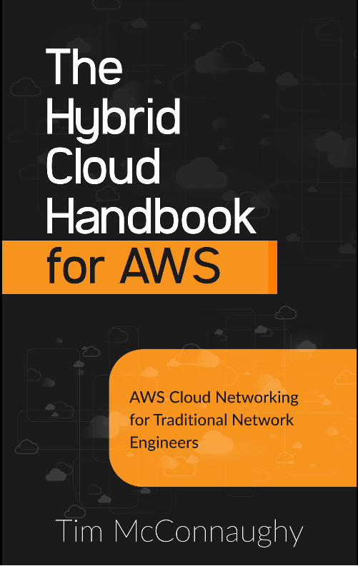

# AWS Hybrid Cloud Handbook

### Find my attached notes after reading "The Hybrid Cloud Handbook for AWS".  
### The purpose of the book is to get traditional network engineers conversational about cloud networking concepts and therefore my notes are also written in a way that a network engineer would understand by contrasting concepts and technologies with technologies that a network engineer would be familiar with.
### You can find the notes [Here](./notes.md)

