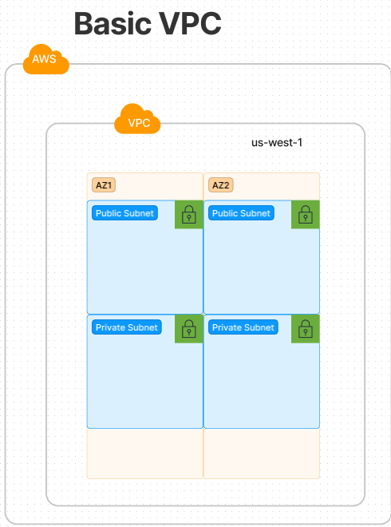
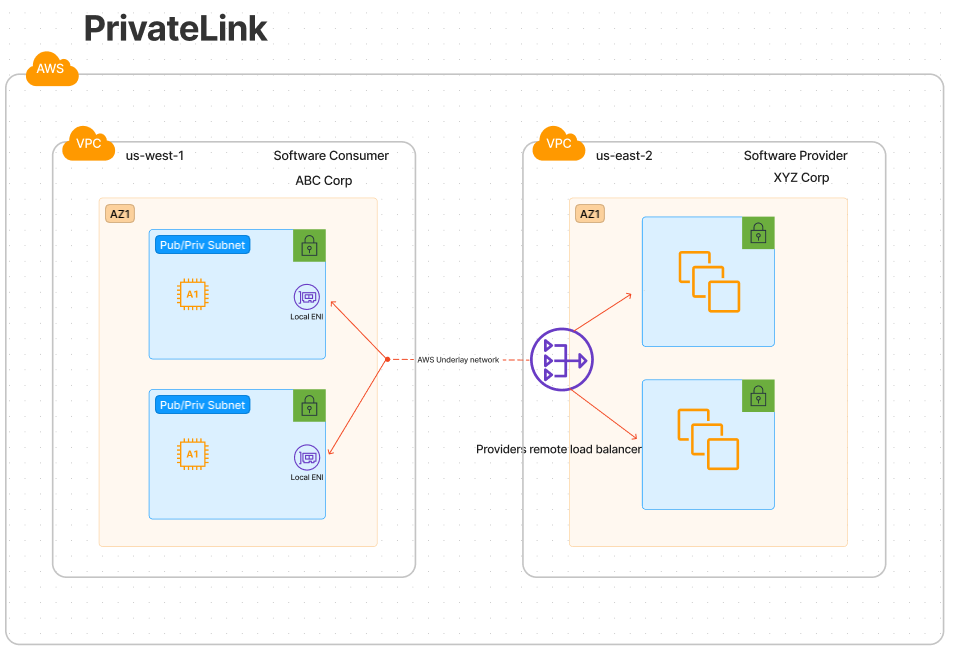
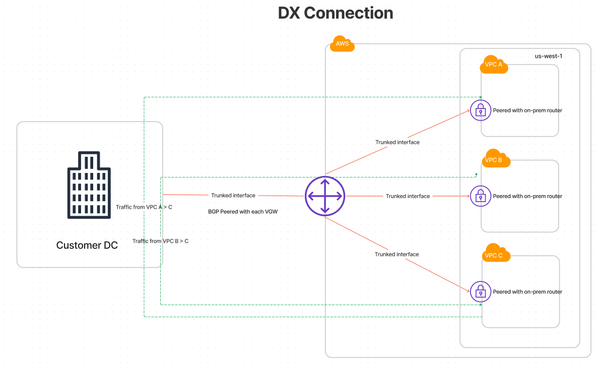
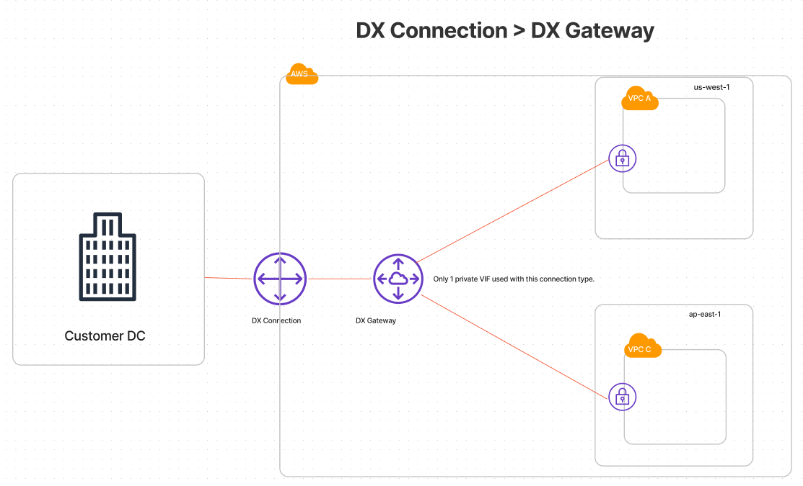

# The Hybrid Cloud Handbook for AWS - Notes

## Chapters
1. [Cloud Networking](#what-is-the-cloud-networking)
2. [Cloud OSI model and Networking](#osi-models-in-the-cloud)
3. [VPC](#vpc)
4. [Subnets and AZs](#subnets-and-azs-availability-zones)
5. [DHCP/DNS](#dhcp-and-dns-services)
6. [Route Table](#cloud-route-table)
7. [ENI](#eni-elastic-network-adaptor)
8. [VPC Peering](#vpc-peering)
9. [PrivateLink](#privatelink)
10. [VPC Endpoints](#endpoints-gatewayinterface)
11. [Internet Gateway](#interet-gateway-igw)
12. [IPv6 Egress Internet Gateway](#egress-only-internet-gateway-ipv6)
13. [Elastic IPs](#elastic-ip)
14. [NAT Gateways](#nat-gateway)
15. [Network Virtual Appliance](#network-virtual-appliances)
16. [Virtual Private Gateway](#virtual-private-gateway-vgw)
17. [VPN](#vpn-customer-gatewayvirtual-private-gateway)
18. [Direct Connect](#direct-connect-dx)
19. [VIF](#vif---virtual-interface-privatepublictransit)
20. [Transit Gateway](#transit-gateway)
21. [Direct Connect Gateway](#dx-gateway)
22. [Security](#security)
23. [Load Balancers](#load-balancers)
24. [Terms](#terms)

## _What is the cloud networking?_
- At the highest level, its simply a highly available, massively redundant underlying physical topology of interconnected networks with tunneling technologies like IPsec, GRE, and VXLAN powering customer interconnectivity.
- Routing isolation is provided through overlays as described above.  Through tunneling, CSP's (Cloud Service Providers) are able to provide customers the ability to create, update, and destroy logical networks with seemingly limitless capacity.
- The cloud was developed out of a desire from developers to have a quick and easy environment from which they could develop and turn out a product quickly.  Because of this, CSP's tried to make the cloud as easy as possible to create and manage by those without expert domain knowledge at least in the case of networking.

## _OSI models in the cloud._
- Network engineer operating in the cloud will find a brave new world where switching loops are a thing of the past!
- Networking starts at layer 3 in the cloud!  There are no physical interfaces and certainly no bridges or switches to be concerned with.
- When you create a networking construct in the cloud its going to be routed, and most traffic steering is going to be through the use of route tables (unless you venture into the world of NVAs aka network virtual appliances and enter into overlay inception).

## _VPC_
- At its simplest form its a self-contained routed domain.
- Below is an example of what AWS would present as a classic VPC account in one region, one VPC , along with 2 public subnets and 2 private subnets spread across 2 availability zones.

- Network engineers could more simply look at a VPC as illustrated below, a router with 4 routed domains attached.  When a packet is sourced from one of those domains to one of the remote domains it consults the route table in the middle and is delivered to the final destination.
- Similar to this physical illustration of a VPC the actual VPC incorporates a similar concept.  Each VPC has a **VIRTUAL** router sitting between all the subnets in a VPC, and while the data place does not physically traverse that router, it is consulted (at the control place) whenever packets are bound for another network.

### _Random VPC facts_
- AWS pre-creates a default VPC in each region.
    - Every VPC that's created receives a 172.31.0.0/16 CIDR notation.
    - The default VPC was originally created to give developers a sandbox to allow development without having network knowledge.

## _Subnets and AZ's (Availability Zones)_
- Regions are a geographical area of the world where AWS operations.
- AZ's are generally considered to be a datacenter within a particular region.
- Subnets are tied to an AZ and a VPC, each VPC is tied to a region.
- A single subnet can only inhabit one AZ.
- Each subnet has 5 addresses reserved for network purposes.
    - x.x.x.0: network address
    - x.x.x.1: VPC Router IP (usually default gateway)
    - x.x.x.2: DNS services for subnet
    - x.x.x.3: future use
    - x.x.x.255: broadcast address (but not used for broadcast)
- Public VS Private subnets
    - AWS defines a public subnet as one that has a default route to an internet gateway, that’s it.  That doesn't necessarily mean your hosts can reach the internet, just that a route out exists.  They still would require a public IP associated or a NAT gateway to actually traverse the internet.
    - AWS defines a private subnet as one that does not have a route to the internet.

### _Random subnet/AZ facts_
- Each AWS account has their AZ list randomized as a form of load balancing on the AWS side.  This prevents every customer from choosing AZ 1 and overloading AWS's capacity.
    - i.e. AZ1 for customer A may be AZ4 for customer B.

## _DHCP and DNS services_
- DHCP and DNS services are provided by each VPC.
- DHCP and DNS could also be provided by the user through the amazon market place or a custom solution.
- By default resources created in a VPC will be assigned a private IP and DNS hostname/record automatically by AWS.
- DNS resolver provided by Route 53 as the mechanism for enabling DNS allocation and queries.

## _Cloud route-table_
- Surprisingly it appears cloud networking is highly static.  There are very few constructs in the cloud that involve dynamic routing as network engineers would expect in a traditional environment.
- Instead we find a lot of static route table manipulation to get packets from one location to another.
- Routing within a VPC is very generic by default.  When creating a VPC you must choose a parent subnet (as large as /16 or small as /28).  The resulting route table will show one entry, a "local" route to that designated VPC CIDR block.  
    - This single route entry is all you get to start your routing journey.  Any additional endpoints will either need to be statically added, or dynamically added depending on the software services added and whether they actually place a route in that route table.
    - Lets address the concept of the "local" route as described above.  Just because its considered local, that does not mean it is physically local to the VPC router.  These hosts will be separated out diversely between availability zones and almost assuredly will not be physically local by any stretch of the imagination.
- Route tables in the cloud are more like VRF's to a traditional network engineer.  
    - The route table is logical and can be associated with subnets to isolate or direct traffic for the associated subnets as the engineer see's fit.
    - Just like a VRF that can have interfaces, peering relationships, and routes associated with it.  These routers are associated with subnets to isolate and direct traffic.
- Sticky route: The 'local' route described above is one that cannot be moved or removed.  That route will always persist to ensure inter-VPC communication.
    - If you want to change the inter-VPC traffic flow you would simply inject static routing to force traffic in a certain direction.

## _ENI (Elastic Network Adaptor)_
- ENI's are as close as we get to a physical interface in cloud networking.  It is a logical interface that can be attached to a host, a service, a database etc. and ultimately is what accepts incoming traffic to that logical object.  Its also the only thing that associates this service or host to your VPC.
    - Lets take for example an EC2 instance that you create.  Lets say you could even create that compute instance without an ENI attached.  If you created that compute instance without an ENI it would simply be some logical instance floating out in some global AWS space but unassociated with any of your logical routing infrastructure.  Since there is no concept of physical infrastructure in the cloud you need a way of always tying a resource back to your logical infrastructure in some way.  The ENI is how we associate objects to our logical routing infrastructure.
- ENI's are tied to the AZ in which it was created.
- ENI's function exactly like a VNIC in VMWare speak.

## _VPC Peering_
- VPC peering is the easiest option to connect two VPCs together.
- Can be established between a single account or multiple accounts.
- Can be established intra-region or cross-region.
- Peering like everything else in the cloud is an "object" in the fabric.  But it represents an underlay connection to that isolated routing environment.
- Route table:
    - Interestingly a peering association can be a destination for traffic.  Unlike traditional networking, where IP's must be defined as the destination here we have a route that would define a route and the cross connection as the destination.
        - If you need to go to 10.10.10.0/24 go here > vpc-12345
    - Remember all the static routing required in the cloud?  Here we are again subject to creating static routes pointing to the other VPC if we need to access resources in that VPC. Both sides must point to routes on the opposite VPC for traffic to successfully traverse the connection.  Nothing here is dynamically updated.
- **VPC PEERING IS NOT TRANSITIVE**
    - Something to keep in mind when building peering relationships.  You cannot use one VPC as transit to a further remote destination.  Below are some examples.
        - VPC A and VPC B are peered together.  VPC B has an internet gateway, VPC A does not.  VPC A cannot use B's internet gateway as an egress point.
- In summary, VPC peering is not complex to set up.  But it does have the manual overhead of setting up routing between each VPC and because it is not transitive any connectivity required between peers means another peering session for each additional VPC that requires connectivity.
    - For instance full mesh between 4 VPC's would mean would require 6 peering relationships.  Assuming each VPC only has 1 subnet and therefore only one route table we would need to update 8 route tables.  You see how this does not scale well the more the peering grows.

## _PrivateLink_
- At a high level Privatelink provides connectivity between two endpoints using the **AWS underlay networking**.
    - To better understand how it works, it can be distilled down to a simple tunnel between two endpoints.
    - A few examples of Privatelink technology in use would be from Gateway endpoints, interface endpoints, and SaaS solutions from a third party vendor.  They will be mentioned in the 'endpoints' section but know that privatelink simply gives a consumer of a resources the ability to utilize a service as though its a local construct within their VPC and regardless of whether its a publicly available resource (S3, Dynamo DB, etc.) or a private resources (third party API, or even internal tooling residing in another VPC, Region, or account).

    

## _Endpoints (Gateway/Interface)_
- What is an endpoint?  Its just a tunneling technique to bridge two logical objects together and provide local connectivity to something that may be a remote object.  Whether a public object that would normally require internet access to connect to, or a private object in another customers private VPC.  End points simply provide connectivity by bridging these objects to one another.
- Gateway Endpoint
    - Attaches to the VPC, **NOT a subnet** (as opposed to an interface endpoint that provides an actual ENI in the certain subnets.).
    - Spans AZ's and reachable by all subnets (again this attaches to a VPC so you would expect all subnets inside it to be able to reach).
    - Targets are actually prefix lists, not a specific IP address.  
        - For instance S3 might have 2,3,5,7 IP's that you can interface with to reach the service.  Instead of a multitude of IP's as the target, you get a prefix list as the target and it will encompass all those IP's.
    - Regional only, cannot span regions.
    - As expected, VPC traffic cannot be transitive and therefore cannot be shared amoung peered VPCs.
- Interface Endpoint
    - Interface endpoints result in an ENI associated with a specific subnet and therefore uses an IP in that subnet range.
    - HA only achievable through multiple endpoints in multiple subnets.
    - If DNS is enabled in VPC, DNS entries are inserted into VPC to direct calls to that endpoint.

## _Internet Gateway (IGW)_
- An object that attaches to a VPC, **NOT a subnet**.  It provides internet access for anything in a VPC that has public IP addressing.
- IGW is is **redundant** within a region.
- IGW is not configurable or addressable.
- IGW is actually doing a 1:1 NAT mapping.  
    - Maps the public IP to private ip of an ENI.
- We can create an edge association with an IGW.
    - Allows the ability to create a **custom route table for the IGW**.
    - Allows traffic coming **FROM** the internet to be sent to a different destination than the VPC router.
- **IGW does not actually provide internet access, it simply performs NAT for workloads lacking elastic IPs.**

## _Egress-only Internet Gateway (IPv6)_
- IPv6 are by default globally routable.  This is not an AWS rule, this is a IEEE standard, globally routable IPv6 space is globally routable.  Because of this AWS created the **Egress-Only** internet gateway.  It will allow outbound internet, but not inbound (similar to an IPv4 NAT gateway).

## _Elastic IP_
- An elastic IP is a static, public IP address.
- Similar to an ENI, an elastic IP is a host tracking entry in AWS fabric.
- A host with an elastic IP isn't actually aware of the elastic public IP.
    - Within AWS it doesn't actually work normal network constructs where we assign a static IP to a resource.
    - Its once again creating a static 1:1 NAT on the IGW within the VPC.

## _NAT Gateway_
- Can perform public OR private NAT.
- Can translate IPv6 to IPv4 or vice versa.
- If public internet connectivity is the goal, NAT gateway MUST be placed in a public subnet (a subnet with a default route to an IGW).
- To reiterate, you cannot share this service with another VPC via VPC peering.  VPC peering is not transitive therefore will not be available as a shared service.

## _Network Virtual Appliances_
- NVA extends the functionality of cloud architectures by allowing you to make different rules.
    - This is accomplished by introducing your own data plane over the top of your own cloud infrastructure.
- NVA can be a double edged sword.  You can create your own elaborate routing, firewall, segmentation rules to do very finite filtering.  But you gain significant complexity.
    - An engineer trying to troubleshoot routing issues would need to not only resolve the generic cloud routing rules, but would then need to understand the overlay topology created by a network virtual appliance.

## _Virtual Private Gateway (VGW)_
- VGW is a tracked host object that can terminate multiple VPN tunnels or a DX connection.
- VGW do nothing in them selves, they must be attached to a VPC to be used.
- VGW are region specific and can only be attached to **ONE** VPC.  BUT it can be moved between VPC as long as they are within the same region.
- Since VGW's are specific to a subnet, they are highly available by default.

## _VPN: Customer Gateway/Virtual Private Gateway_
- AWS supports site to site VPN's using IPsec as the ONLY supported VPN technology at this time.
- Two sides of a VPN, the customer gateway (customer owned equipment) and virtual private gateway (VGW) which is the logical construct in AWS that can terminate the VPN connection.
- Static or dynamic routing (BGP) can be used to share prefixes over the tunnel.
- VGW set creates two tunnels for redundancy in different AZs.
- There is a limited number of prefixes that can be shared via BGP, this is due to the hyperscale of AWS infrastructure and the number of customers.

## _Direct Connect (DX)_
- This is a physical connection to AWS directly or via a third party.
- DX is a trunk that supports IEEE 802.1Q.
    - Supports splitting that trunk into multiple types of VIFs (Virtual interfaces).
- DX acts more like a switch than anything else, it simply facilitates a layer 2 connection between VGW and on-prem router.
    - Its worth noting that if you had a DX connection with 3 VPCs (that were not peered together) and those VPC's needed to communicate, the VPC's would consult their route table and if they had a route to the other VPCs, traffic would need to go all the way back on-prem before being routed back into AWS.  
    - The point to mention is that there is no routing intelligence within the DX connection.
    - Check the image below for an illustration of the traffic flow.
    
- Direct connect is just a physical port on AWS infrastructure that connects to AWS fabric.
- Peering requirements:
    - 1, 10, and 100 Gbps speds supported depending on whether you directly peer or whether you have a third party hosting the connection on your behalf.
    - Single mode fiber required, no copper.
    - Manual speed and duplex settings.
    - BGP only supported protocol, must be backed by MD5 authentication.
    - MTU's supported:
        - 1500
        - 9100 (over private VIF)
        - 8500 (over transit VIF)
    - BFD supported
    - MACsec (mac level security) supported

## _VIF - Virtual Interface (Private/Public/Transit)_
- A VIF can be condensed down to a VLAN that gives access to different areas of the AWS cloud or offer different connectivity.
- Private VIF
    - Connects your on-prem services to the AWS cloud VPC environment privately.
    - Privates logical connectivity to customer VPC via BGP peering over the VLAN.
    - Connects to a VGW in a **SINGLE** VPC within the same AWS region.
    - VGW can propagate routes learned via the customer side into the VPC route table if desired.
    - You can have multiple VIFs connect to different VPCs via VGW (within the same region).
- Public VIF
    - Same basic technology used for interconnectivity.  Trunked interface, public VIF, and BGP for route exchange.
    - Instead of connecting to private resources you gain direct connectivity to public services (perhaps for regulatory reasons you don't want to use these public services over the internet.).
        - With this connectivity you can access them over AWS's private backbone, NOT via the public internet.
    - Public or limited set of private BGP ASNs can be used in peering relationship.
        - With public ASN usage you can do things like AS-PATH prepending.  
        - If using private ASN this is not possible.
    - By default, AWS will advertise ALL AWS region IPs over the public VIF.
    - If it is not preferred that you can access resources globally, you can use communities to filter those routes out.
    - Review this documentation [here](https://docs.aws.amazon.com/directconnect/latest/UserGuide/routing-and-bgp.html) to better understand VIF's and the associated communities.
    - Notice the image below and the BGP communities being advertised back into our on-prem router.  The first set of routes near the top are advertised with a community of 7224:8100.  AWS documentation notes that this community is associated with routes that originate from the same AWS region in which the AWS direct connect PoP is associated.  The second route below it has 7224:8200, this is for routes in the same **continent** as the direct connect.  Lastly the remaining routes are untagged and encompass the remaining regions and continents.

    - Public inbound routes from AWS also come with the well-known "NO_EXPORT" community tag so no customers become a transit network into the AWS network.
    - Public OUTBOUND routes should also be sent with a community.  Namely 7244:9100,9200, or 9300.  These will tell AWS how far to advertise prefixes into their network.  9100 will only propagate your routes into the local AWS region.  9200 will advertise all routes into the associated continent.  9300 will advertise your prefixes globally.
        - Similar to the NO_EXPORT community AWS exports, they too will not advertise your prefix out to the rest of the internet.
- Transit VIF
    - A special VIF created solely to connect a DX to a transit gateway.
    - **Only ONE transit VIF per DX**

## _Transit Gateway_

- The Transit Gateway (TGW) is a managed routing/<u>**data plane**</u> service.  This construct is as close as network engineers get to a virtual appliance that actually controls traffic at the data and control plane.
- It handles static and dynamic routing and connects cloud native constructs together.
- Under the hood it’s just a beefed up virtual machine.
- It can peer BGP and terminate IPsec or GRE tunnels.
- It actually lives **OUTSIDE** the construct of a VPC but tied to a particular region.
    - Because the TGW is tied to a region it can only attach to VPC's in that region.
- <u>**If using TGW in multiple regions, the TGW's can be peered together cross region.** </u>
- TGW has a main/default route table similar to VPCs.
    - But route tables differ from VPCs in this way.
        - CIDR ranges from attached VPCs are **automatically** propogated to the TGW main route table.
- Since the TGW will know the remote networks residing inside the VPCs granular network controls can be instantiated within the TGW for easier administrative control and potentially centralized management.
- Transit Gateway VS Direct Connect
    - Take notice of the image below.  This is to contrast the difference between a DX gateway and a transit gateway.  DX gateway which is not routing aware vs a transit gateway which is routing aware.
    - This solution provides an cloud native routing solution, all traffic traversing its data plane between on-prem and between VPC's.  
    - In the image below we see a BGP peering relationship with the Transit gateway (made available via DX).  From there, the VPC's are attached to the transit gateway in a hub and spoke model.  Traffic needing to go from one VPC to another will route to the transit gateway and into the other VPC.

    
## _DX Gateway_
- DX Gateway avoids some of the challenges of the traditional Direct Connect (DX).  Lets briefly cover the differences.
    - DX (traditional):
        - Region locked.
        - Limit on number of VIFs that can be created.
        - Can be used for Public, Private, Transit VIFs.
        - 1:1 mapping between VIFs and VPCs (ie. 1 VIF maps to one VPC)
    - DX Gateway:
        - Not region locked, in fact its a global AWS construct.
        - Extends number of VPCs that can be connected.
        - Can only be used for Private VIFs.
        - 1:10~ mapping between VIFs and VPCs (ie. 1 VIF can connect to as many as 10 VPCs as of right now)

    - What are the similarities between the DX and the DX Gateway?
        - DX Gateway still has no routing intelligence, its still just acts like a logical switch.  So routing between VPCs would still require the data and control path to traverse back to the customer gateway.

    - DX gateways and Private VIF (to VPC)
        - Looking at the example below we can see a similar design to the DX example, however here we see only a single VIF utilized to form our BGP peering session.  In addition, take notice of the fact that we can now connect to more than one region.  Again this global construct is no longer region locked allowing one peering session to give us network connectivity to all of our regions.

    

    - DX Gateways and Transit VIF (to Transit Gateways)
        - DX Gateway also extends the single VIF concept to transit gateways.  The singular transit VIF can connect to one or more transit gateways. In the image below, notice the single DX gateway connected to 2 TGW's.  In this case traffic between the work loads hanging off the TGW can communicate within the cloud, but the workloads in separate regions, attached to separate TGWs would need to go all the way back to the on-prem router to communicate (assuming there is no transit gateway peering, which the graphic does not demonstrate.) 

        - Another thing to mention from the graphic below is the use of **TWO** DX gateways.  A DX Gateway can peer with a private or transit VIF, but not both.  If both types are required, you need two separate DX Gateways.

    

    - Two take aways from the examples above:
        - No matter whether you're using a private or transit VIF attached to a DX gateway, the routing control plane and data plane is the on-prem router.
        - DX Gateway can utilize a private or transit VIF, not both.

## _Security_
- There are generally three types of over-arching AWS managed security concepts in AWS.
    - Security groups (SG, host level security applied to ENI or VNIC in vmware terms)
    - Network Access List (NACL, subnet level security)
    - Firewalls (packet inspection)

- Security Groups
    - The closest real world example of a security group is an ACL applied to the NIC of a host.
    - SG only allow traffic, they do not deny it.
    - SG are stateful.
    - SG can be reused as needed.  They can be applied to any number of ENI's as needed.
    - Can be used to enforce micro-segmentation if needed within a subnet.
    - SG can even be the source for another SG traffic!
        - For example, lets say we have a group of 10 servers hosting a web app with security group "sg-front-end".  We also have a group of 10 databases that should never be interacted with except from the front end servers.  You could set the security group associated with the database servers to only accept incoming traffic from the "sg-front-end" security group.  At that point, only hosts with the "sg-front-end" SG would be able to communicate with the DB servers.
    - Multiple can be applied to an ENI, when done so they are OR'd together.

- Network ACL
    - Similar to an ACL in the traditional sense.  They are numbered and iterated over in order top down.  On the first match of a rule, that action is carried out against the packet.
    - Can use accept or deny rules.
    - Applied at subnet level.
    - Stateless
        - Because they are stateless the creator must remember to open ephemoral ports on return traffic or traffic will only go one direction (traffic will go in but never return.).
    - Only one NACL per subnet.
    - NACL must be created for each VPC, cannot be moved around.
    - NACL's are useless if traffic never leaves the subnet, if traffic is intra-subnet it will never leave or return and therefor NACL is never consulted.

- AWS managed firewall
    - Inspects traffic within and between VPCs.
    - Must specify what subnets will be protected by the firewall.
        - Subnets needing protection will recieve an ENI within subnet.
    - This firewall is similar to what you would expect.  The complexity mostly comes from the routing construct you set up to support this functionality.  Will you set up routes in your subnets to traverse the firewall, will you set up a gateway load balancer intra-vpc, or will you set up an inspection vpc connected to a TGW.  These are a few things to consider when launching a firewall for inspection.

## _Load balancers_
- Load balancers come in 4 flavors, but most likely only 3 choices in reality.
    - ~~Classic~~ (Mostly unecesssary)
    - Network load balancer (NLB)
    - Application load balancer (ALB)
    - Gateway load balancer (GWLB)
- Network
    - Layer 4 load balancer (only takes action based on port and protocols).
    - Internal or Internet facing
    - Highly available (self-healing).  If the local subnet ENI fails, AWS creates a new one.
    - Must be configured with a _target group_
        - A target group is simply a logical cluster of endpoints.  
    - Must be configured with a _listener_
        - A service that is open and waiting for connections.
        - Multiple listeners can be configured for an NLB.
    - Cross zone (ie. cross AZ) load balancing possible for redundancy and for situations where workloads are unevenly split.  
        - The later situation prevents over utilization of targets in one AZ over another.
        - For example, if you had 5 targets in one AZ and 10 in a second AZ.  All of them listening for requests.  If you had 50/50 load balancing, your AZ with 5 targets would be massively over used compared to the AZ with 10 targets.
    - If terminating SSL/TLS connections is required.  It needs to be done against the host.  NLB's will simply pass that connection right through and cannot terminate a connection.
    - Cannot be used with security groups.  This is only mentioned because ALB's CAN be used with security groups.
    - Does work with privatelink technology.
- Application
    - Uses application level data to make load balancing decisions.
        - Can use headers, domain names, request methods ect to route traffic to the correct back-end pool.
    - Allocated IP and DNS name by AWS and cannot be statically configured.
    - ONLY LISTENS ON HTTP/HTTPS.
    - Terminates TLS/SSL connections, but must have a certificate if using HTTPS.
    - Since ALBs terminate connections, source IP will always be the IP of the ALB not the sending device IP.
        - If source IP is needed, header includes X-Forward Header which includes that original IP.
    - ALB can use application-layer health checking rather than simply checking whether ports are open.  It can actually check for specific web page content or server responses.
    - DOES NOT work with PrivateLink technology by default.
    - Can be used with security groups.
- Gateway
    - This load balancers main objective is to make it easier to insert 3rd party security appliances into a traffic flow.
    - GWLB is added into route tables as a destination target.  From there traffic enters the load balancer, gets inspected and is spit right back out to its actual intended destination.
    - The low level details on how this works is that the GWLB actually tunnels the traffic to the security appliance using the "GENEVE" protocol.  Which simply wraps the packet in an outer layer and preserves the inner packet.  
        - The traffic flow would look like this for an internet bound packet that needs inspection:
            - Host sends packet to google.com > route table consulted > 
                - default route out of VPC is chosen > 
                    - default route sends traffic to the GWLB > 
                        - GWLB encapsulates the original traffic using GENEVE 
                            - GENEVE packet is stripped off and packet is analyzed by firewall > 
                                - firewall inspection is done
                            - < packet is forwarded back to GWLB but first encapsulted in GENEVE
                        - < GWLB consults routing table and forwards traffic to internet gateway but first it strips off GENEVE
                    - < packet is sent to google.com.
        - Below is an example of what the return traffic would look like.

## _Terms_
Transit Gateway: AWS Managed Router that allows for static and dynamic routing.
- DX: Direct connect, a private circuit between on-prem and cloud resources.
- VIF: Virtual Interface, a way of identifying a VLAN.
- VGW: Layer 3 construct serving as either a VPN or layer 3 termination point.
- VPC: Routing domain with a CIDR supernet.
- Private VIF: Allows access to private AWS environment.
- Public VIF: Allows access to public resources over AWS backbone.
- Transit VIF: Connects to a TGW.
